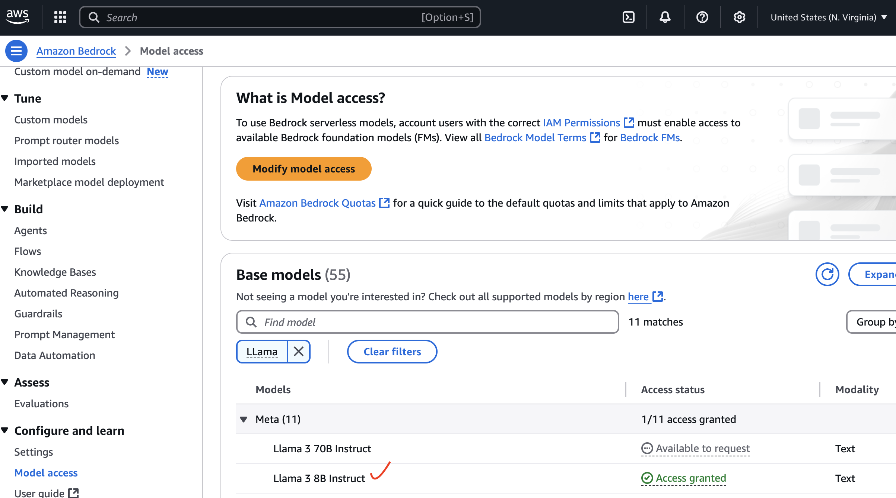
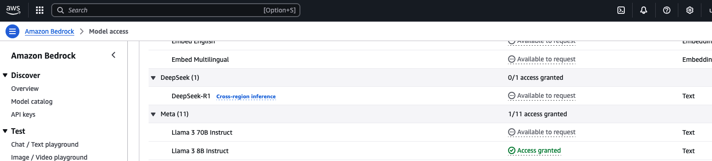

# LynxLab

### Pre requsities
1. Python3, pip3
2. aws cli
3. Request model access (Titan Text G1 - Express ) 
4. Request model access (Llama 3 8B Instruct ) 

### Setup
1. pip install -r requirements.txt
2. Need to configure ~/.aws/config
    [default]
    region = <your-region>
    aws_access_key_id = <your-secret-key-id>
    aws_secret_access_key = <your-secret-access-key>
3. Set the value for APIGW_TOKEN , (export APIGW_TOKEN='*****')
4. Run python3 driver.py create --> To create the stack
5. Run python3 driver.py update --> To update the stack
6. Run python3 driver.py getUrl --> To get the invocation url
7. Sample usage of the model --> curl -s -X GET -H "Authorization: Bearer $APIGW_TOKEN" "<apiGetUrl>/invoke?inputText=What%20is%20the%20capital%20of%20India?
8. Run python3 driver.py destroy --> To destroy the stack

### Sample usage

curl --location '<yourUrl>/invoke?inputText=Gill%20%2C%20Rahul%20and%20Jaiswal%20got%20out%20for%200%20runs%20in%20cricket%20match%20against%20Australia&inputTask=Perform%20the%20sentiment%20analysis' \
--header 'Authorization: Bearer ******'