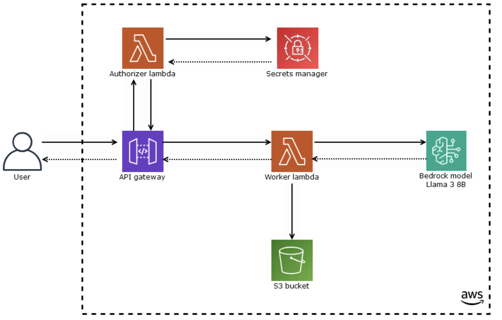

# LynxLab — Terraform Deployment Guide

LynxLab is a cloud lab setup utility that streamlines the deployment of an AI-driven pipeline, illustrated through a sentiment analysis use case. Beyond AI experimentation, it enables security practitioners to simulate attacks and evaluate defense strategies for serverless components in the cloud.

> **What is Terraform?** Terraform is an Infrastructure as Code (IaC) tool that lets you define and provision cloud resources using configuration files instead of clicking through a console. Running `terraform apply` creates everything you need in one shot; `terraform destroy` tears it all down cleanly.

---

## :building_construction: What Gets Deployed

| Resource | Description |
|---|---|
| **API Gateway (HTTP API)** | Entry point for all requests — route: `ANY /invoke` |
| **Authorizer Lambda** | Validates the `Authorization: Bearer <token>` header on every request |
| **Main Lambda** | Receives authorized requests, calls AWS Bedrock, logs results to S3 |
| **AWS Secrets Manager** | Stores the Bearer token used by the Authorizer Lambda |
| **S3 Bucket** | Stores every request/response pair as a timestamped `.txt` file |
| **IAM Roles & Policies** | Least-privilege roles for each Lambda and API Gateway |

### Architecture



```
Client
  │  POST /invoke?inputText=...&inputTask=...
  │  Authorization: Bearer <token>
  ▼
API Gateway (HTTP API)
  │
  ├──► Authorizer Lambda ──► Secrets Manager (validates token)
  │         └── allow / deny
  ▼
Main Lambda
  ├──► AWS Bedrock (AI inference)
  └──► S3 Bucket (logs request + response)
```

---

## :pencil: Prerequisites

### 1. Terraform
Any latest stable version above 1.0 works. Install via Homebrew (macOS):
```bash
brew tap hashicorp/tap
brew install hashicorp/tap/terraform
```
Or download directly from: https://developer.hashicorp.com/terraform/install

Verify your installation:
```bash
terraform -version
```

### 2. AWS CLI — configured with credentials
```bash
aws configure
```
You'll be prompted for:
- `AWS Access Key ID`
- `AWS Secret Access Key`
- `Default region` (e.g. `us-east-1`)
- `Default output format` (e.g. `json`)

### 3. AWS Bedrock model access
The main Lambda calls Amazon Bedrock. You need to enable model access in your AWS account before deploying.

Follow the steps in [README-model-access.md](README-model-access.md) to request access to the model used (default: `us.amazon.nova-micro-v1:0`).

> If you are **not** in a US region, change the `bedrock_model_id` variable to the correct regional model ID, for example `amazon.nova-micro-v1:0` (without the `us.` prefix).

### 4. Set your API token environment variable
Before deploying, decide on a token that will be used to authenticate all API requests. This token is stored in AWS Secrets Manager and checked by the Authorizer Lambda on every call.

```bash
export APIGW_TOKEN="<your-chosen-token>"
```

> **Tip:** A convenient option is to use your AWS secret access key, since it's already available via the CLI:
> ```bash
> export APIGW_TOKEN=$(aws configure get aws_secret_access_key)
> ```

---

## :rocket: Deployment

### Step 1 — Initialise Terraform
Run this once to download the AWS and archive providers:
```bash
cd terraform
terraform init
```

### Step 2 — Deploy the stack
Pass your token as the `auth_secret_value` variable. This is the value that gets stored in Secrets Manager and must match the `Authorization: Bearer <token>` header in every API request.

```bash
terraform apply \
  -var="auth_secret_value=$APIGW_TOKEN" \
  -auto-approve
```

You can also use a custom token string directly:
```bash
terraform apply \
  -var="auth_secret_value=my-custom-secret-token" \
  -auto-approve
```

> **Why is this prompted?** `auth_secret_value` has no default because it is marked `sensitive` — Terraform never prints it to the terminal. If you run `terraform apply` without passing `-var="auth_secret_value=..."`, Terraform will ask:
> ```
> var.auth_secret_value
>   Value of the authorization secret:
>
>   Enter a value:
> ```
> Enter the same value you set as `APIGW_TOKEN`.

### Step 3 — Get the API URL
After a successful apply, Terraform prints the invoke URL:
```
Outputs:

api_invoke_url = "https://xxxx.execute-api.us-east-1.amazonaws.com/dev/invoke"
api_endpoint   = "https://xxxx.execute-api.us-east-1.amazonaws.com"
```

If you need the URL again later:
```bash
terraform output api_invoke_url
```

---

## :zap: Using the API

Send a request using `curl`, passing `inputText` (content to analyze) and `inputTask` (what to do with it):

```bash
curl -s -X GET \
  -H "Authorization: Bearer $APIGW_TOKEN" \
  "<api_invoke_url>?inputText=<your-text>&inputTask=<your-task>"
```

**Example — sentiment analysis:**
```bash
curl -s -X GET \
  -H "Authorization: Bearer $APIGW_TOKEN" \
  "https://xxxx.execute-api.us-east-1.amazonaws.com/dev/invoke?inputText=The%20product%20exceeded%20my%20expectations&inputTask=Perform%20sentiment%20analysis"
```

**Example response:**
```json
{
  "analysis": "The sentiment expressed is positive. The phrase 'exceeded my expectations' indicates a high level of satisfaction."
}
```

---

## :wrench: Variables Reference

| Variable | Default | Required | Description |
|---|---|---|---|
| `aws_region` | `us-east-1` | No | AWS region to deploy all resources |
| `auth_secret_name` | `AuthSecret` | No | Name of the secret in Secrets Manager |
| `auth_secret_value` | — | **Yes** | The Bearer token stored in Secrets Manager and checked on every request |
| `bedrock_model_id` | `us.amazon.nova-micro-v1:0` | No | Bedrock model ID — change prefix for non-US regions |
| `bucket_name` | `logs-bucket-test-1` | No | Used as a label in Lambda env vars (actual bucket name is auto-generated) |

Override any variable at apply time:
```bash
terraform apply \
  -var="auth_secret_value=$APIGW_TOKEN" \
  -var="aws_region=eu-west-1" \
  -var="bedrock_model_id=amazon.nova-micro-v1:0" \
  -auto-approve
```

---

## :wastebasket: Teardown

To destroy all resources created by Terraform:
```bash
terraform destroy -auto-approve
```

> The S3 bucket (`force_destroy = true`) and the Secrets Manager secret (`recovery_window_in_days = 0`) are both configured to delete immediately — no manual cleanup needed.

---

## :hammer: Troubleshooting

### 403 Forbidden on API requests

**Symptom:** The stack deployed successfully but every API call returns `403 Forbidden`.

**Cause:** The token in Secrets Manager does not match the value in your `Authorization` header. This can happen if the secret was previously set with a different value (e.g. from a previous `terraform apply`).

**Fix:**
```bash
# Step 1: force-delete the stale secret (bypasses the 30-day recovery window)
aws secretsmanager delete-secret \
  --secret-id AuthSecret \
  --force-delete-without-recovery

# Step 2: re-set it to match your current APIGW_TOKEN
aws secretsmanager put-secret-value \
  --secret-id AuthSecret \
  --secret-string "$APIGW_TOKEN"
```

Then verify the secret was updated correctly:
```bash
aws secretsmanager get-secret-value --secret-id AuthSecret --query SecretString --output text
```

---

### Secret already exists on `terraform apply`

**Symptom:**
```
Error: creating Secrets Manager Secret: ResourceExistsException: The operation failed
because the secret AuthSecret already exists.
```

**Cause:** A secret with the same name exists in your account (likely from a previous deployment).

**Fix:**
```bash
aws secretsmanager delete-secret \
  --secret-id AuthSecret \
  --force-delete-without-recovery

# Then re-run apply
terraform apply -var="auth_secret_value=$APIGW_TOKEN" -auto-approve
```

---

### Bedrock model not available in your region

**Symptom:** The main Lambda returns a 500 error mentioning the model ID.

**Cause:** The default model ID `us.amazon.nova-micro-v1:0` uses a US-region cross-inference prefix and may not be available outside the US.

**Fix:** Override the model ID at deploy time:
```bash
terraform apply \
  -var="auth_secret_value=$APIGW_TOKEN" \
  -var="bedrock_model_id=amazon.nova-micro-v1:0" \
  -auto-approve
```
Also ensure you have requested model access for the chosen model — see [README-model-access.md](README-model-access.md).

---

### `terraform apply` prompts for `auth_secret_value` interactively

**Cause:** The `-var` flag was not passed on the command line.

**Fix:** Always pass the variable explicitly:
```bash
terraform apply -var="auth_secret_value=$APIGW_TOKEN" -auto-approve
```
Or set it in a `terraform.tfvars` file (do **not** commit this file):
```hcl
auth_secret_value = "my-secret-token"
```

---

## :link: Related

- [Security Scenarios](README-scenarios.md) — Attack simulation and defense strategies
- [Bedrock Model Access](README-model-access.md) — How to enable model access in AWS console
